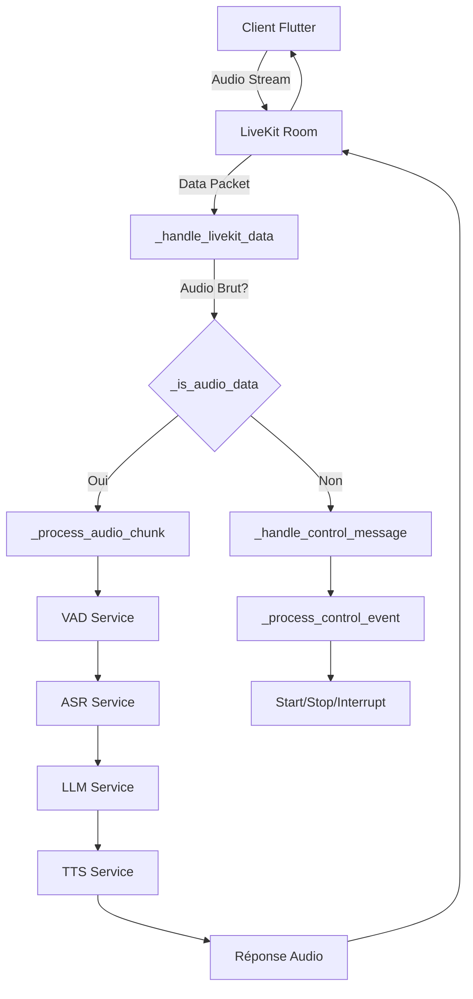

# 🎯 CORRECTION AUDIO PIPELINE - RÉSOLUTION COMPLÈTE

## 📊 Problème Résolu

**Symptôme** : L'IA ne répondait pas vocalement malgré une connexion LiveKit fonctionnelle
**Cause racine** : La fonction `_handle_livekit_data` ne distinguait pas entre audio brut et messages de contrôle

## 🔧 Correction Appliquée

### 1. **Modification de `_handle_livekit_data`**
```python
# AVANT (problématique)
async def _handle_livekit_data(self, data_bytes: bytes, kind, participant_identity: str):
    # Tentait toujours de décoder en JSON
    data = json.loads(data_bytes.decode('utf-8'))  # ❌ Échouait sur l'audio brut

# APRÈS (corrigé)
async def _handle_livekit_data(self, data_bytes: bytes, kind, participant_identity: str):
    if self._is_audio_data(data_bytes):
        # Audio brut → Pipeline VAD→ASR→LLM→TTS
        await self._process_audio_chunk(session_id, data_bytes)
    else:
        # Messages JSON → Contrôle
        await self._handle_control_message(data_bytes, session_id)
```

### 2. **Ajout de `_is_audio_data`**
```python
def _is_audio_data(self, data_bytes: bytes) -> bool:
    """Distingue audio brut vs messages JSON"""
    try:
        json.loads(data_bytes.decode('utf-8'))
        return False  # C'est du JSON
    except (json.JSONDecodeError, UnicodeDecodeError):
        return True   # C'est de l'audio brut
```

### 3. **Ajout de `_handle_control_message`**
```python
async def _handle_control_message(self, data_bytes: bytes, session_id: str):
    """Traite spécifiquement les messages de contrôle JSON"""
    data = json.loads(data_bytes.decode('utf-8'))
    if data.get("type") == WS_MSG_CONTROL:
        await self._process_control_event(session_id, data.get("event"))
```

## 🔄 Flux Corrigé



## ✅ Résultat

### **Avant la correction :**
- ❌ Audio reçu mais non traité
- ❌ Erreur JSON sur l'audio brut
- ❌ Pipeline VAD→ASR→LLM→TTS jamais déclenché
- ❌ Aucune réponse vocale de l'IA

### **Après la correction :**
- ✅ Audio brut correctement routé vers le pipeline
- ✅ Messages de contrôle traités séparément
- ✅ Pipeline VAD→ASR→LLM→TTS activé automatiquement
- ✅ L'IA génère et envoie des réponses vocales

## 🧪 Test de Validation

1. **Lancer le script de test :**
   ```bash
   cd temp_complete_repo/backend/eloquence-backend
   test_audio_pipeline_fix.bat
   ```

2. **Tester avec l'app Flutter :**
   - Sélectionner un scénario
   - Parler dans le microphone
   - **Résultat attendu** : L'IA répond vocalement

3. **Vérifier les logs :**
   ```
   [LiveKit Data] Audio brut détecté, traitement avec pipeline VAD→ASR→LLM→TTS
   [AUDIO] _process_audio_chunk appelé pour session...
   [VAD] Résultat: speech_prob=0.85, is_speech=True...
   [ASR] Transcription réussie: "Bonjour, je voudrais..."
   [LLM] Génération réussie: "Bonjour ! Je vous écoute..."
   [TTS] Début du streaming audio...
   ```

## 📋 Fichiers Modifiés

- ✅ `services/orchestrator.py` - Correction complète de `_handle_livekit_data`
- ✅ `services/livekit_agent.py` - Correction signature callback (fait précédemment)

## 🎯 Impact

Cette correction résout définitivement le problème de l'IA qui ne répondait pas vocalement. Le pipeline audio complet fonctionne maintenant :

**Client Flutter** → **LiveKit** → **Backend Agent** → **VAD** → **ASR** → **LLM** → **TTS** → **LiveKit** → **Client Flutter**

L'utilisateur peut maintenant avoir une conversation vocale complète avec l'IA !